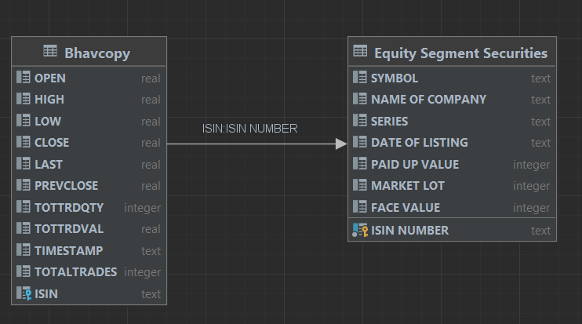

Schema for the Database:


1. Query for top25 gainers on given day,
    
```sqlite
SELECT
    t1.TIMESTAMP,
    t2."NAME OF COMPANY",
    t2.SYMBOL,
    ((t1.CLOSE-t1.OPEN)/t1.OPEN) as "Gain",
    t2."SERIES"
from Bhavcopy as t1
    INNER JOIN "Equity Segment Securities" as t2
    ON t1.ISIN = t2."ISIN NUMBER"
ORDER BY Gain desc
limit 25;
```
Result for above query 
```html
<!DOCTYPE html>
<html>
<head>
<title></title>
<meta charset="UTF-8">
</head>
<body>
<table border="1" style="border-collapse:collapse">
<tr><th>TIMESTAMP</th><th>NAME OF COMPANY</th><th>SYMBOL</th><th>Gain</th><th>SERIES</th></tr>
<tr><td>13-OCT-2022</td><td>Hindcon Chemicals Limited</td><td>HINDCON</td><td>0.15222375057313167</td><td>EQ</td></tr>
<tr><td>13-OCT-2022</td><td>Indo Amines Limited</td><td>INDOAMIN</td><td>0.13513513513513514</td><td>EQ</td></tr>
<tr><td>13-OCT-2022</td><td>Suzlon Energy Ltd-RE</td><td>SUZLON-RE</td><td>0.1250000000000001</td><td>BE</td></tr>
<tr><td>13-OCT-2022</td><td>DSJ Keep Learning Limited</td><td>KEEPLEARN</td><td>0.10416666666666667</td><td>BE</td></tr>
<tr><td>13-OCT-2022</td><td>Liberty Shoes Limited</td><td>LIBERTSHOE</td><td>0.1041639641976911</td><td>EQ</td></tr>
<tr><td>13-OCT-2022</td><td>Pennar Industries Limited</td><td>PENIND</td><td>0.10359869138495092</td><td>EQ</td></tr>
<tr><td>13-OCT-2022</td><td>Aditya Birla Money Limited</td><td>BIRLAMONEY</td><td>0.10042553191489371</td><td>EQ</td></tr>
<tr><td>13-OCT-2022</td><td>Dredging Corporation of India Limited</td><td>DREDGECORP</td><td>0.09993763642033057</td><td>EQ</td></tr>
<tr><td>13-OCT-2022</td><td>RITES Limited</td><td>RITES</td><td>0.09959525874530224</td><td>EQ</td></tr>
<tr><td>13-OCT-2022</td><td>Rajdarshan Industries Limited</td><td>ARENTERP</td><td>0.093603744149766</td><td>EQ</td></tr>
<tr><td>13-OCT-2022</td><td>Kritika Wires Limited</td><td>KRITIKA</td><td>0.08937198067632858</td><td>EQ</td></tr>
<tr><td>13-OCT-2022</td><td>Next Mediaworks Limited</td><td>NEXTMEDIA</td><td>0.0882352941176471</td><td>EQ</td></tr>
<tr><td>13-OCT-2022</td><td>Apollo Sindoori Hotels Limited</td><td>APOLSINHOT</td><td>0.0876251666040122</td><td>EQ</td></tr>
<tr><td>13-OCT-2022</td><td>PVP Ventures Limited</td><td>PVP</td><td>0.08641975308641989</td><td>EQ</td></tr>
<tr><td>13-OCT-2022</td><td>Rama Steel Tubes Limited</td><td>RAMASTEEL</td><td>0.08457943925233642</td><td>EQ</td></tr>
<tr><td>13-OCT-2022</td><td>Vertoz Advertising Limited</td><td>VERTOZ</td><td>0.08041060735671507</td><td>EQ</td></tr>
<tr><td>13-OCT-2022</td><td>Ortel Communications Limited</td><td>ORTEL</td><td>0.08000000000000007</td><td>BZ</td></tr>
<tr><td>13-OCT-2022</td><td>Bedmutha Industries Limited</td><td>BEDMUTHA</td><td>0.07994186046511628</td><td>EQ</td></tr>
<tr><td>13-OCT-2022</td><td>Hotel Rugby Limited</td><td>HOTELRUGBY</td><td>0.075268817204301</td><td>BE</td></tr>
</table>
</body>
</html>

```
2. Query for top25 gainers for each day in last 30 working days
```sqlite
with top25 as (
    SELECT *, ROW_NUMBER() over (PARTITION BY TIMESTAMP order by Gain desc ) as rn
    from (
        SELECT *,
        ((t1.CLOSE- t1.OPEN)/t1.OPEN) as Gain
        from Bhavcopy as t1
    )
)
select top25.TIMESTAMP, t2."NAME OF COMPANY", t2.SYMBOL, top25.Gain, top25.rn, t2.SERIES
from top25 join "Equity Segment Securities" as t2 on t2."ISIN NUMBER" = top25.ISIN
where rn <=25;
```
Result for above CTE
```html
<!DOCTYPE html>
<html>
<head>
<title></title>
<meta charset="UTF-8">
</head>
<body>
<table border="1" style="border-collapse:collapse">
<tr><th>TIMESTAMP</th><th>NAME OF COMPANY</th><th>SYMBOL</th><th>Gain</th><th>SERIES</th></tr>
<tr><td>01-SEP-2022</td><td>Rossell India Limited</td><td>ROSSELLIND</td><td>0.15507559395248371</td><td>EQ</td></tr>
<tr><td>01-SEP-2022</td><td>Stel Holdings Limited</td><td>STEL</td><td>0.1476209841398942</td><td>EQ</td></tr>
<tr><td>01-SEP-2022</td><td>Pritika Auto Industries Limited</td><td>PRITIKAUTO</td><td>0.14714714714714733</td><td>EQ</td></tr>
<tr><td>01-SEP-2022</td><td>Tata Teleservices (Maharashtra) Limited</td><td>TTML</td><td>0.139347923179991</td><td>BE</td></tr>
<tr><td>01-SEP-2022</td><td>Paramount Communications Limited</td><td>PARACABLES</td><td>0.13624678663239087</td><td>BE</td></tr>
<tr><td>01-SEP-2022</td><td>Hindware Home Innovation Limited</td><td>HINDWAREAP</td><td>0.12890625</td><td>EQ</td></tr>
<tr><td>01-SEP-2022</td><td>IFCI Limited</td><td>IFCI</td><td>0.1284403669724771</td><td>EQ</td></tr>
<tr><td>01-SEP-2022</td><td>RKEC Projects Limited</td><td>RKEC</td><td>0.1268403171007928</td><td>EQ</td></tr>
<tr><td>01-SEP-2022</td><td>Compucom Software Limited</td><td>COMPUSOFT</td><td>0.12582781456953648</td><td>EQ</td></tr>
<tr><td>01-SEP-2022</td><td>Fineotex Chemical Limited</td><td>FCL</td><td>0.12258530420653543</td><td>EQ</td></tr>
<tr><td>01-SEP-2022</td><td>Bharat Gears Limited</td><td>BHARATGEAR</td><td>0.12122905027932955</td><td>EQ</td></tr>
<tr><td>01-SEP-2022</td><td>Manaksia Coated Metals &amp; Industries Limited</td><td>MANAKCOAT</td><td>0.11528150134048269</td><td>EQ</td></tr>
<tr><td>01-SEP-2022</td><td>Ashima Limited</td><td>ASHIMASYN</td><td>0.11272727272727277</td><td>EQ</td></tr>
<tr><td>01-SEP-2022</td><td>Best Agrolife Limited</td><td>BESTAGRO</td><td>0.11229787234042557</td><td>EQ</td></tr>
<tr><td>02-SEP-2022</td><td>Automotive Stampings and Assemblies Limited</td><td>ASAL</td><td>0.1746478873239436</td><td>EQ</td></tr>
<tr><td>02-SEP-2022</td><td>Shiva Mills Limited</td><td>SHIVAMILLS</td><td>0.1725197541703249</td><td>EQ</td></tr>
<tr><td>02-SEP-2022</td><td>EIH Limited</td><td>EIHOTEL</td><td>0.1717581047381545</td><td>EQ</td></tr>
<tr><td>02-SEP-2022</td><td>Surana Solar Limited</td><td>SURANASOL</td><td>0.1656050955414012</td><td>EQ</td></tr>
<tr><td>02-SEP-2022</td><td>AksharChem India Limited</td><td>AKSHARCHEM</td><td>0.16362492133417242</td><td>EQ</td></tr>
<tr><td>02-SEP-2022</td><td>Royal Orchid Hotels Limited</td><td>ROHLTD</td><td>0.1536782361929709</td><td>EQ</td></tr>
<tr><td>02-SEP-2022</td><td>Country Club Hospitality &amp; Holidays Limited</td><td>CCHHL</td><td>0.13636363636363633</td><td>BE</td></tr>
<tr><td>02-SEP-2022</td><td>MIRC Electronics Limited</td><td>MIRCELECTR</td><td>0.11141304347826092</td><td>EQ</td></tr>
<tr><td>02-SEP-2022</td><td>TCNS Clothing Co. Limited</td><td>TCNSBRANDS</td><td>0.10589510547819561</td><td>EQ</td></tr>
</table>
</body>
</html>

```
